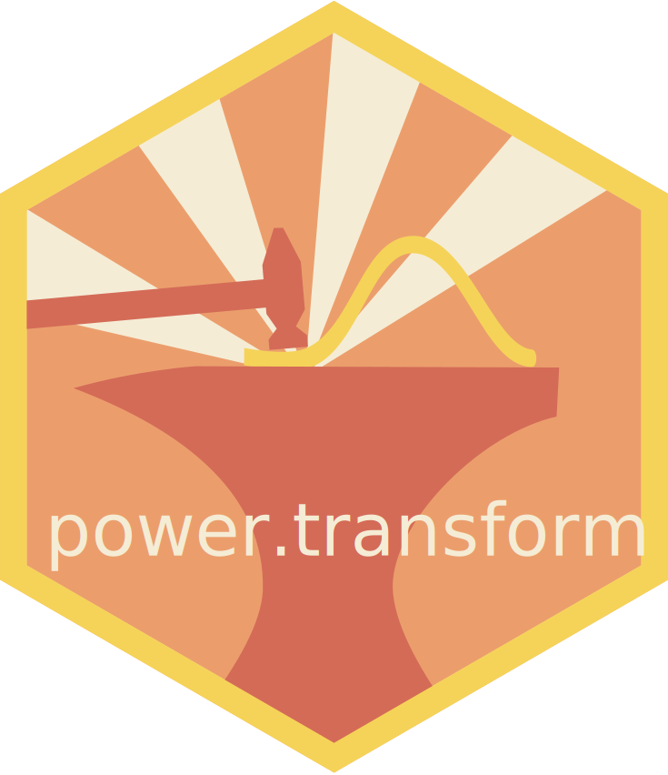

# power.transform 

`power.transformation` is an R-package for power transformation of data to
normality.

## Installation

Stable versions of `power.transformation` can be installed from CRAN.

    install.packages("power.transformation", dependencies=TRUE)

`power.transformation` can also be directly installed from Github:

    require(devtools)
    devtools::install_github("https://github.com/alexzwanenburg/power.transform")

